# Extrawatch Grav Stats Plugin

The **Extrawatch Grav Stats** Plugin is an extension for [Grav CMS](http://github.com/getgrav/grav). 
It integrates the ExtraWatch dashboard available from https://app.extrawatch.com into the Grav admin panel.
It also renders javascript snippet, which tracks each visit. User just needs to enter its project ID.

## Features:

### Click heat map
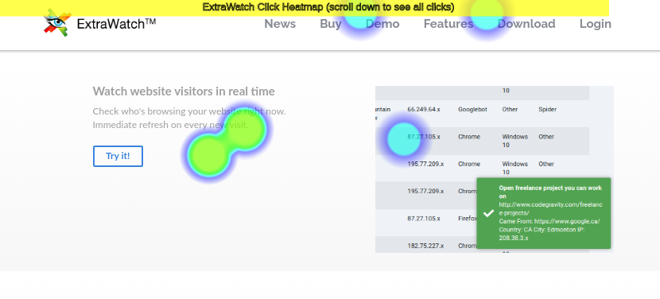

See the list of most popular pages sorted by most of the clicks. By selecting a page from the drop-down menu, website view below refreshes and opens the page with heat map overlay displaying the click heatmap.


### Location on a map
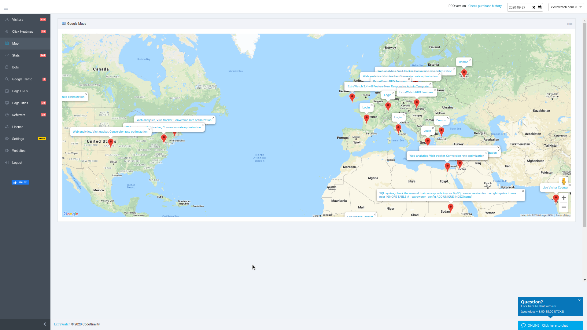

When there is a new visit from some other part of the world, the view moves to this location. It's very interesting to see how the whole world interacts with your web in real time.

### Real time visits
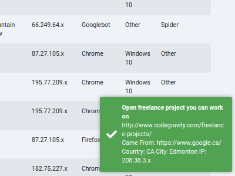

Notification on each new visit of your website in real time

### Track multiple websites
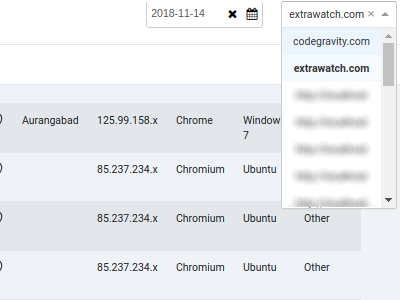

You are able to track multiple websites this way and switch between these websites in by using the drop-down in the upper right corner.


## Installation

Installing the Extrawatch Grav Stats plugin can be done in one of three ways: The GPM (Grav Package Manager) installation method lets you quickly install the plugin with a simple terminal command, the manual method lets you do so via a zip file, and the admin method lets you do so via the Admin Plugin.

### GPM Installation (Preferred)

To install the plugin via the [GPM](http://learn.getgrav.org/advanced/grav-gpm), through your system's terminal (also called the command line), navigate to the root of your Grav-installation, and enter:

    bin/gpm install extrawatch-grav-stats

This will install the Extrawatch Grav Stats plugin into your `/user/plugins`-directory within Grav. Its files can be found under `/your/site/grav/user/plugins/extrawatch-grav-stats`.

### Manual Installation

To install the plugin manually, download the zip-version of this repository and unzip it under `/your/site/grav/user/plugins`. Then rename the folder to `extrawatch-grav-stats`. You can find these files on [GitHub](https://github.com/f/grav-plugin-extrawatch-grav-stats) or via [GetGrav.org](http://getgrav.org/downloads/plugins#extras).

You should now have all the plugin files under

    /your/site/grav/user/plugins/extrawatch-grav-stats
	


```yaml
enabled: true
```

## Usage

On enabling the plugin, you should see new icon in admin panel:

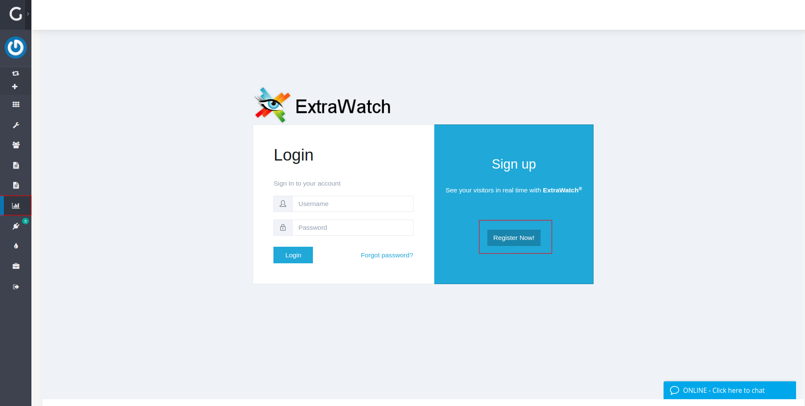

When no project ID is specified in plugin settings, you will see the login / register form.

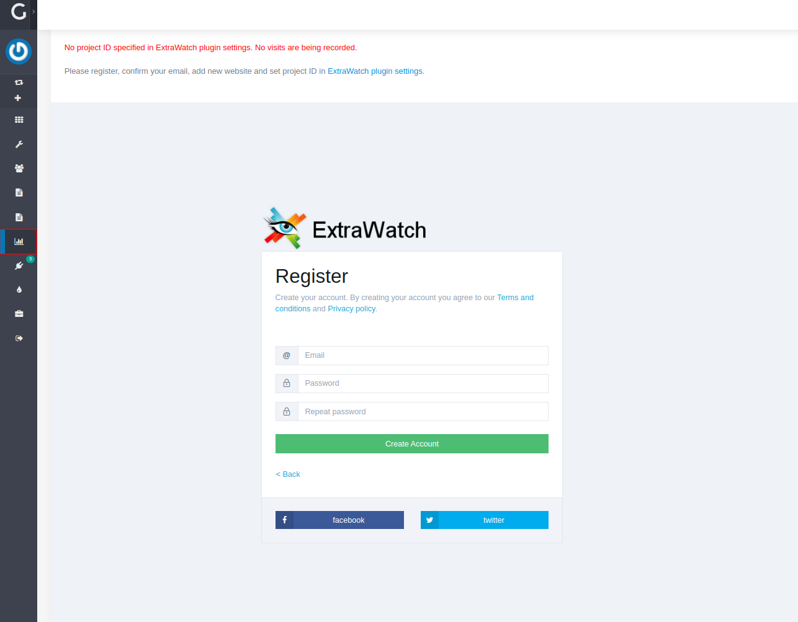
Enter your email and password


Check your email and log in

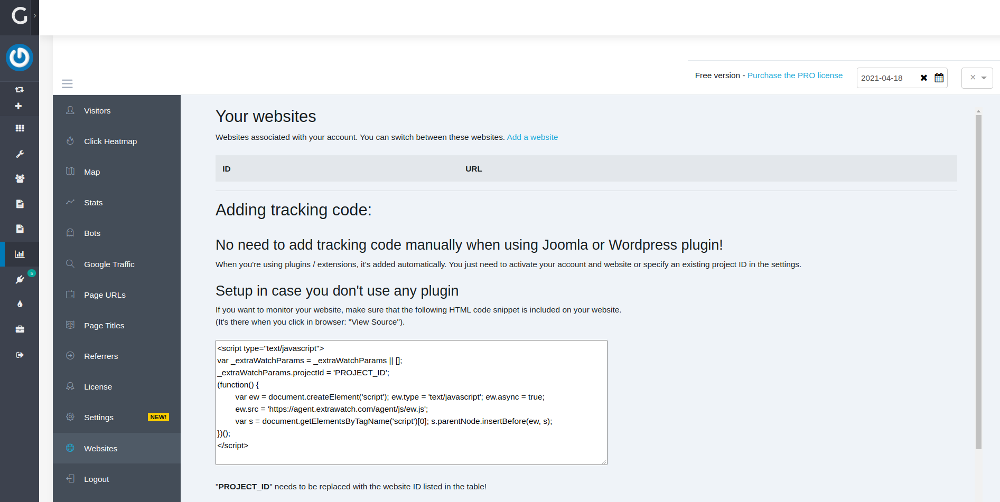
Click "Add website"

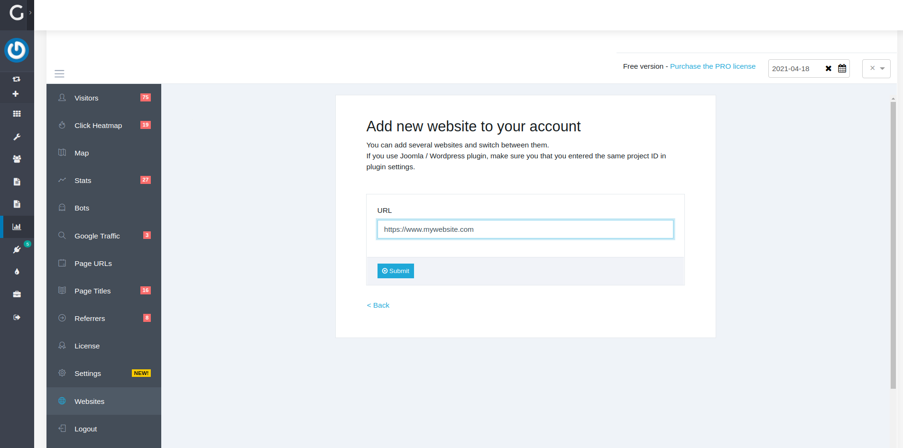
Enter your website's URL and confirm

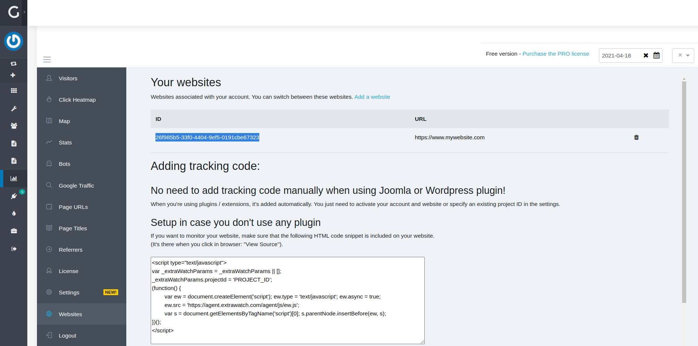
Copy your project ID

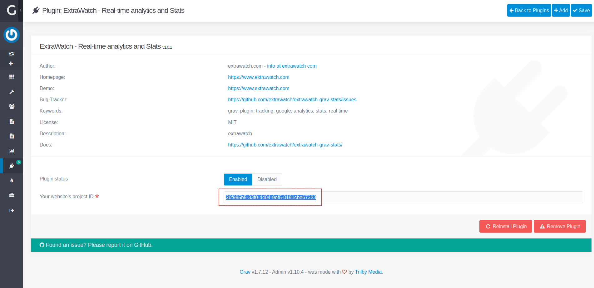
Enter this website's ID into plugin settings and click save

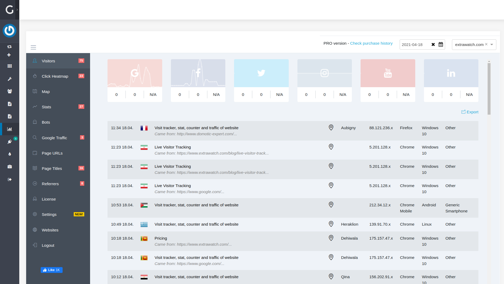
After entering and saving your project ID, when you click on icon in admin menu, 
you should see dashboard with list of visitors who visit your website in real time.


